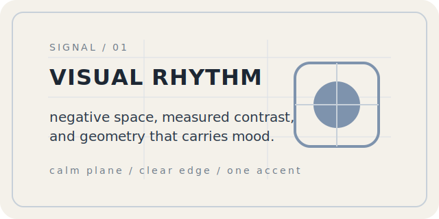
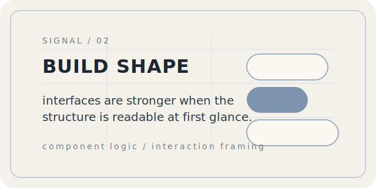
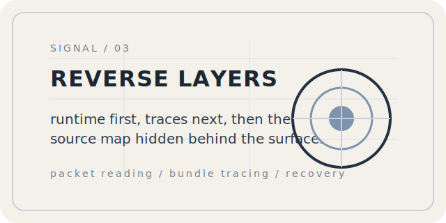

<h1 align="center">Sherry</h1>

  

  <a href="#about">about</a>
  /
  <a href="#signals">signals</a>
  /
  <a href="#layers">layers</a>
  /
  <a href="#contact">contact</a>

  quiet geometry / interface tension / reverse reading / visual systems

## about

I like building pages that feel precise, calm, and a little sharp.

My work usually sits around code, reverse engineering, interaction structure, and visual rhythm.
I care about spacing, sequence, restraint, and the small signals that make an interface feel deliberate.

 

## signals

<table>
  <tr>
    <td width="33%" valign="top">
      
    </td>
    <td width="33%" valign="top">
      
    </td>
    <td width="33%" valign="top">
      
    </td>
  </tr>
</table>

 

## layers

  
<strong>layer 01 · current thinking</strong>

   

  - interfaces should feel edited, not crowded
  - motion is strongest when it is implied by structure
  - interaction gets better when each layer has one job
  - reverse work starts with runtime truth, then source follows

  
<strong>layer 02 · process and tools</strong>

   

  | field | focus |
  | --- | --- |
  | layout | grid, rhythm, offset geometry, negative space |
  | frontend | interaction framing, component shaping, readable systems |
  | reverse | request tracing, bundle reading, protocol recovery |
  | tooling | small utilities that remove drag and sharpen flow |

  
<strong>layer 03 · notes behind the surface</strong>

   

  I like interfaces that leave room to breathe.

  I usually prefer one strong move over many decorative ones, one accent over a full spectrum, and one clear interaction cue over noisy ornament.

  This page follows the same rule set: clean plane, measured contrast, visible structure, and only a few places to click.

 

## contact

  <a href="https://github.com/SherryBX">github</a>
  /
  <a href="#top">back to top</a>

  built as a profile surface, shaped for clarity and interaction.

