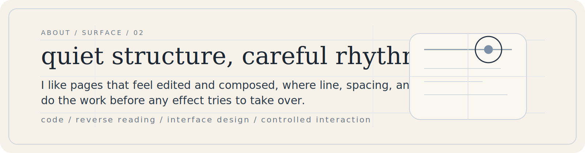
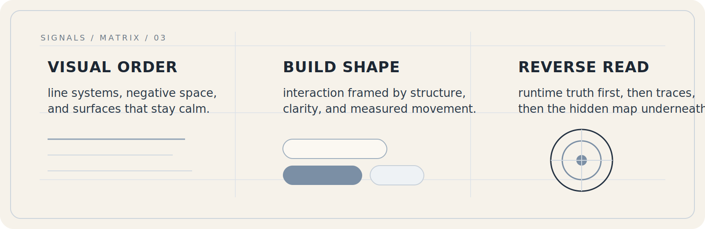

  

  <a href="#about">about</a>
  /
  <a href="#signals">signals</a>
  /
  <a href="#layers">layers</a>
  /
  <a href="#contact">contact</a>

  geometric linework / elegant surfaces / measured interaction

 

  

 

  

 

  

  
<strong>layer 01 / direction</strong>

   

  - elegant pages with visible structure
  - interaction cues that arrive quietly
  - geometry that guides the eye and keeps the plane calm
  - one strong move, then restraint everywhere else

  
<strong>layer 02 / focus</strong>

   

  | field | focus |
  | --- | --- |
  | interface | profile surfaces, dashboards, compact systems |
  | frontend | structure, rhythm, interaction framing |
  | reverse | bundle reading, request tracing, protocol recovery |
  | tooling | small utilities that make workflows lighter |

  
<strong>layer 03 / notes</strong>

   

  I like linework that feels architectural, not decorative.

  I prefer a page that looks composed from the first screen, then reveals more only when you open it.

  This README follows that same idea: a quiet surface, geometric anchors, and just enough interaction to make the page feel alive.

 

  <a href="https://github.com/SherryBX">github</a>
  /
  <a href="#top">back to top</a>

  designed as a profile page with line, tension, and restraint.

