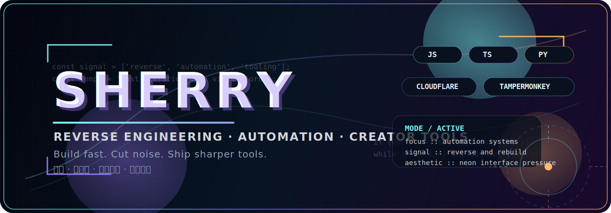

<div align="center">
  
  <br />
  <br />
  
  <br />
  <br />
  
  
  
</div>

<h2 align="center">⚡ SYSTEM.BOOT</h2>

```txt
operator  :: Sherry
focus     :: reverse engineering / automation / creator tooling
stack     :: JavaScript / TypeScript / Python / Cloudflare / Tampermonkey
vibe      :: cyber neon / sharp motion / practical build energy
status    :: compressing ugly workflows into one clean click
```

<div align="center">
  <sub>把复杂链路变短，把重复动作变轻，把工具做得更有攻击性。</sub>
</div>

<h2 align="center">🧬 NEON CORE</h2>

<table>
  <tr>
    <td width="50%" valign="top">
      <h3>🛠 BUILD MODE</h3>
      <p>
        浏览器脚本、自动化工具、内容工作流组件、Cloudflare 实验项目，
        还有那些一旦做顺手就很难再回头的效率型工具。
      </p>
    </td>
    <td width="50%" valign="top">
      <h3>🔍 DEBUG MODE</h3>
      <p>
        逆向、断点对抗、前端逻辑还原、流程拆解、脚本工程化。
        我喜欢把看起来麻烦的东西掰开、看透、重组。
      </p>
    </td>
  </tr>
  <tr>
    <td width="50%" valign="top">
      <h3>🚀 CURRENT SIGNAL</h3>
      <p>
        正在继续叠加更强的视觉表达、自动化整合能力、以及更狠一点的使用体验。
      </p>
    </td>
    <td width="50%" valign="top">
      <h3>🎯 OUTPUT STYLE</h3>
      <p>
        先打通链路，再压缩摩擦，再把界面和细节一起拉满。
      </p>
    </td>
  </tr>
</table>

<h2 align="center">🧰 STACK OVERDRIVE</h2>

<p align="center">
  
  
  
  
  
  
  
  
</p>

<h2 align="center">🌌 HOT REPOS</h2>

<div align="center">
  <a href="https://github.com/SherryBX/Leave-debugger">
    
  </a>
  <a href="https://github.com/SherryBX/ZHIMOwriter">
    
  </a>
</div>
<div align="center">
  <a href="https://github.com/SherryBX/cloud-mail">
    
  </a>
  <a href="https://github.com/SherryBX/md2picgo">
    
  </a>
</div>
<div align="center">
  <a href="https://github.com/SherryBX/Find-claude-buddy">
    
  </a>
  <a href="https://github.com/SherryBX/n8nUpload4u">
    
  </a>
</div>

<h2 align="center">📡 CONTRIBUTION VOLTAGE</h2>

<div align="center">
  
  
</div>

<div align="center">
  
</div>

<div align="center">
  <picture>
    
  </picture>
</div>

<div align="center">
  
</div>

<h2 align="center">🛰 RADAR</h2>

<div align="center">
  
</div>
<div align="center">
  
  
</div>

<div align="center">
  
</div>

<h2 align="center">🔗 ACCESS PORTALS</h2>

<div align="center">
  <a href="https://github.com/SherryBX?tab=repositories">
    
  </a>
  <a href="https://github.com/SherryBX?tab=stars">
    
  </a>
  <a href="https://github.com/SherryBX?tab=followers">
    
  </a>
</div>


