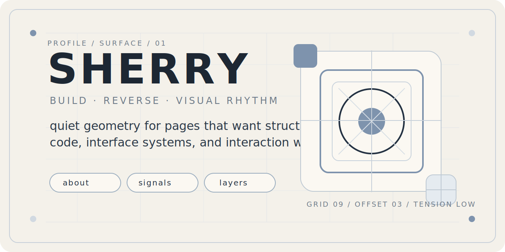
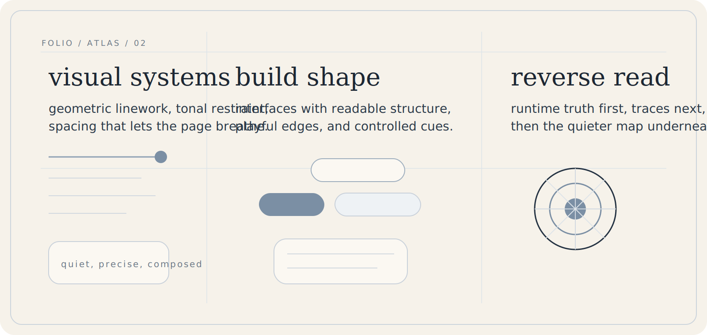
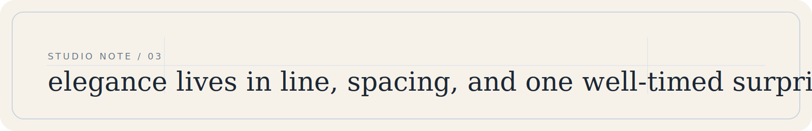
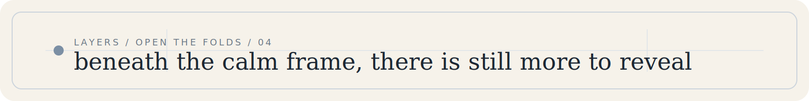
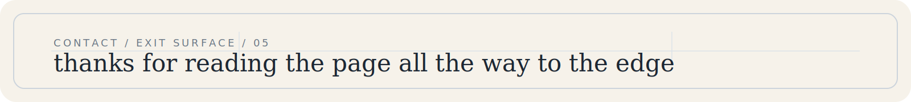

  

  <a href="#folio">folio</a>
  /
  <a href="#layers">layers</a>
  /
  <a href="#contact">contact</a>

  architectural linework / elegant tension / playful restraint

 

  

  

 

  

  
<strong>atelier / 01 / surface notes</strong>

   

  - I like pages that feel composed from the first screen.
  - Linework should guide the eye without asking for attention.
  - The elegant move is usually quiet, precise, and slightly unexpected.
  - Interaction lands best when it feels discovered.

  
<strong>atelier / 02 / current fields</strong>

   

  | field | focus |
  | --- | --- |
  | visual systems | geometry, rhythm, negative space, hierarchy |
  | frontend | layout tension, interaction framing, refined components |
  | reverse | bundle reading, request tracing, protocol recovery |
  | tooling | compact utilities that make hard flows feel light |

  
<strong>atelier / 03 / if curious</strong>

   

  I enjoy profiles that read like a designed page instead of a stacked template.

  So this README leans into one long surface, framed by geometric lines, serif tension, and a few folds you can open when curiosity kicks in.

  There is more room to push this further, especially with denser line choreography and sharper section contrast.

 

  

  <a href="https://github.com/SherryBX">github</a>
  /
  <a href="#top">back to top</a>

  designed as a profile surface with line, poise, and a little mischief.

